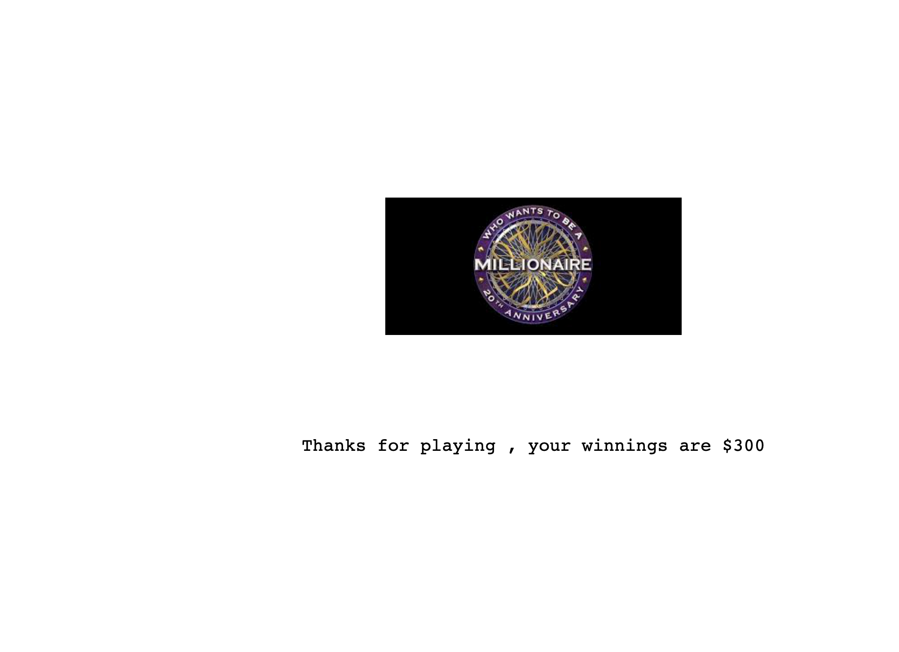

# Code-in-place-Quiz-project
Project created for the summer class of Stanford Code in Place led by instructors Chris and Mehran

This game application is modelled after the TV quiz show "Who wants to be a Millionaire". It asks a series of questions which the user has to get correct. If the user gets 15 questions correct in a row then he wins the prize money. 

The user also has to follow some instructions such as only to enter valid options and if he enters an incorrect option, then he has to enter the option again.

In the end when the game gets over either if the user enters a wrong answer or when the user gets 15 randomly generated questions from a set of 30 questions correct a Canvas is created using the tkinter library. It displays some cool graphics and the winning amount. 

